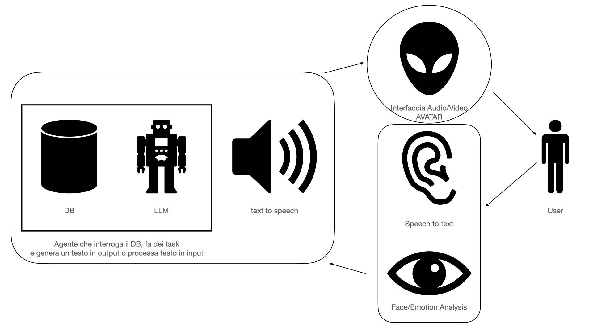

# EMI AI Assistant

## Overview

EMI (EMotional Intelligence) is an AI assistant that processes audio input, generates responses, and animates a 3D face model in real-time. The system utilizes advanced machine learning models for speech recognition, natural language processing, and audio-to-facial animation conversion.

## Features

- Speech-to-text transcription
- AI-powered conversational responses
- Text-to-speech synthesis
- Real-time 3D facial animation
- WebSocket-based communication for live updates

## System Architecture

The EMI system consists of several components:

1. FastAPI Web Server: Handles HTTP requests and WebSocket connections
2. Audio Processing Pipeline: Converts input audio to text and generates AI responses
3. Audio2Mesh Model: Converts audio to 3D facial animations
4. WebSocket Communication: Streams facial animation data and audio to the client

## Installation

1. Clone the repository
2. Install the required packages: `pip install -r requirements.txt`
3. Download the pretrained models: `git lfs pull`

If you don't have Git LFS installed, follow the instructions in the "Downloading Pretrained Models" section below.

## Downloading Pretrained Models

The `pretrained_model` directory contains essential PyTorch model files for EMI's functionality. Due to their large size, these files are stored using Git LFS. Follow these steps to download them:

1. Install Git LFS:
- On macOS: `brew install git-lfs`
- On Windows: Download from https://git-lfs.github.com/
- On Linux: `sudo apt-get install git-lfs`
2. Initialize Git LFS: `git lfs install`
3. Pull the LFS files: `git lfs pull`

## Configuration

The system uses a `config.py` file to store various configuration parameters. Ensure this file is properly set up with the following variables:

- GROQ_API\_KEY: API key for the Groq language model
- ELEVENLABS_API\_KEY: API key for ElevenLabs text-to-speech service
- VOICE_ID: ID of the voice to use for text-to-speech
- GROQ_API\_URL: URL for the Groq API
- GROQ_WHISPER\_URL: URL for the Whisper speech recognition API
- SR: Sample rate for audio processing
- ELEVENLABS_SAMPLE\_RATE: Sample rate for ElevenLabs audio output
- BUFFER_SIZE: Size of the audio buffer
- INITIAL_PROMPT: Initial prompt for the AI assistant
- LATENT_DIM: Latent dimension for the Audio2Mesh model
- OUT_DIM: Output dimension for the Audio2Mesh model
- MODEL_PATH: Path to the pretrained Wav2Vec2 model
- PRETRAINED_A2M\_CKPT: Path to the pretrained Audio2Mesh checkpoint
- FPS: Frames per second for facial animation
- WIDTH: Width of the output frame
- HEIGHT: Height of the output frame
- CHUNK_SIZE: Size of audio chunks for processing

## Components

### 1. chatbot.py

This module handles the core functionality of the AI assistant:

- text_chunker: Splits text into chunks for streaming
- text_to_speech_input_streaming: Converts text to speech using ElevenLabs API
- get_groq_response: Generates AI responses using the Groq language model
- transcribe_audio: Transcribes audio using the Whisper model

### 2. main.py

The main FastAPI application:

- Initializes the FastAPI app
- Includes routing from `routes.py`
- Serves the HTML frontend

### 3. models.py

Defines the neural network models:

- CustomWav2Vec2Model: A modified Wav2Vec2 model for audio processing
- Audio2MeshModel: Converts audio features to 3D mesh coordinates

### 4. processors.py

Handles data processing and model inference:

- DataProcessor: Extracts features from audio input
- AudioProcessor: Manages the Audio2Mesh model and processes audio for facial animation

### 5. routes.py

Defines API routes and WebSocket endpoint:

- /upload/: Endpoint for uploading audio data
- /ws: WebSocket endpoint for streaming facial animation and audio data

## Usage

1. Start the server: `python main.py`
2. Open a web browser and navigate to `http://localhost:8000`
3. Interact with the EMI interface by speaking or uploading audio
4. The system will process the input, generate a response, and animate the 3D face model in real-time

## Development

To extend or modify the EMI system:

1. Update the AI model in `chatbot.py` to change the assistant's behavior
2. Modify the `Audio2MeshModel` in `models.py` to improve facial animation
3. Adjust the `AudioProcessor` in `processors.py` to change audio processing parameters
4. Update the frontend HTML (`EMI_cyberpunk.html`) to modify the user interface

## Security Considerations

- Ensure all API keys are kept secure and not exposed in the codebase
- Implement proper input validation and sanitization for all user inputs
- Use HTTPS for production deployments to encrypt data in transit

## Performance Optimization

- Consider using GPU acceleration for the neural network models
- Implement caching mechanisms for frequently accessed data
- Optimize the WebSocket communication to reduce latency

## Future Improvements

- Implement user authentication and session management
- Add support for multiple languages
- Enhance the 3D facial animation with more expressive features
- Integrate with external APIs for expanded functionality

## Requirements

The project requires the following Python packages:

- fastapi
- uvicorn
- websockets
- aiohttp
- pydub
- numpy
- librosa
- soundfile
- torch
- transformers

For a complete list with version numbers, see the `requirements.txt` file.